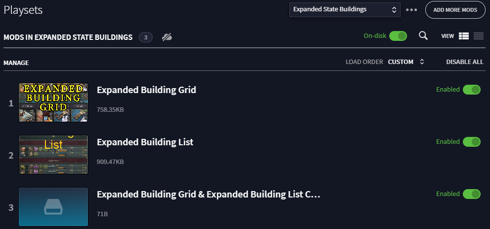

Compatability patch between my [Expanded Building List mod](https://github.com/brianstepnitz/expanded_building_list) and the [Expanded Building Grid mod](https://steamcommunity.com/sharedfiles/filedetails/?id=3278156786). Works with the [Dense UI mod](https://steamcommunity.com/sharedfiles/filedetails/?id=3378734097) too!

Load this mod AFTER both Expanded Building Grid / Dense UI AND Expanded Building List.

*Mod written for Victoria 3 patch 1.9.8*

## Modifications

*UI-only — no gameplay changes.*

- List mode is now the default Building view. If you're using this mod, you're using it for list mode!
- Fixed a bug from vanilla where Buildings would sometimes appear multiple times in list mode.

### Additions
- Hooks for Expanded Building Grid
- Hooks for Expanded Building List

## Links

- My [Expanded Building List mod](https://github.com/brianstepnitz/expanded_building_list)

## Acknowledgements

- The [Expanded Building Grid mod](https://steamcommunity.com/sharedfiles/filedetails/?id=3278156786)
- The [modding information on the Victoria 3 Wiki](https://vic3.paradoxwikis.com/Modding)
- Lots of information floating around [Victoria 3 Mod Co-Op discord](https://discord.gg/XJbqFbHdsM)